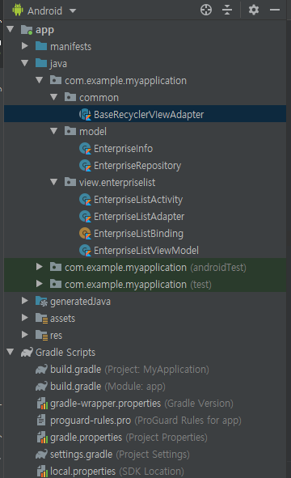
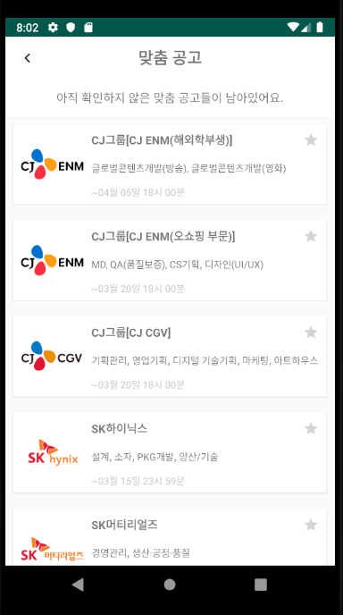

# 자소설 과제

### 개발 환경
- 주 언어 : Kotlin
- 아키텍처 : MVVM(Model-View-ViewModel)

### 사용 라이브러리
- [Viewmodel](https://developer.android.com/topic/libraries/architecture/viewmodel)
- [Glide](https://github.com/bumptech/glide)

### 패키지 구조

### 실행 화면

